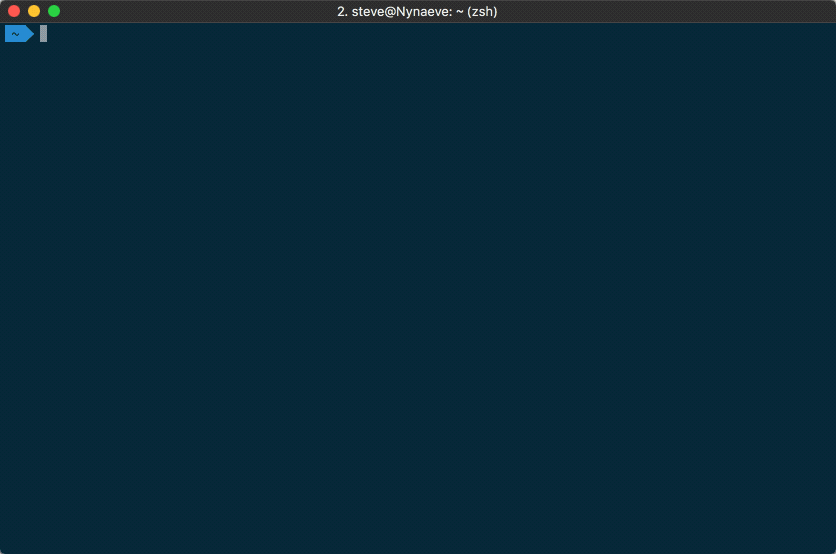
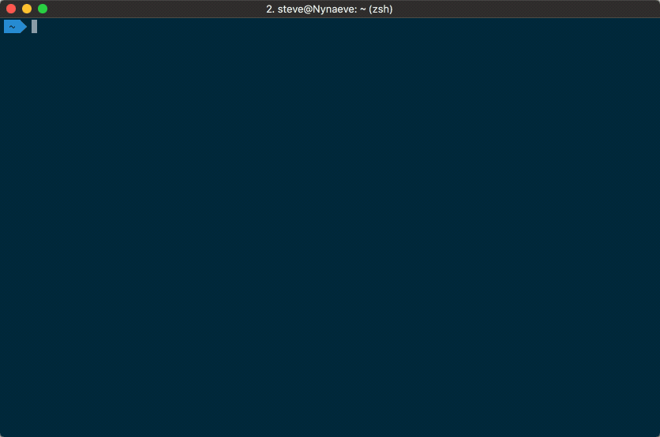
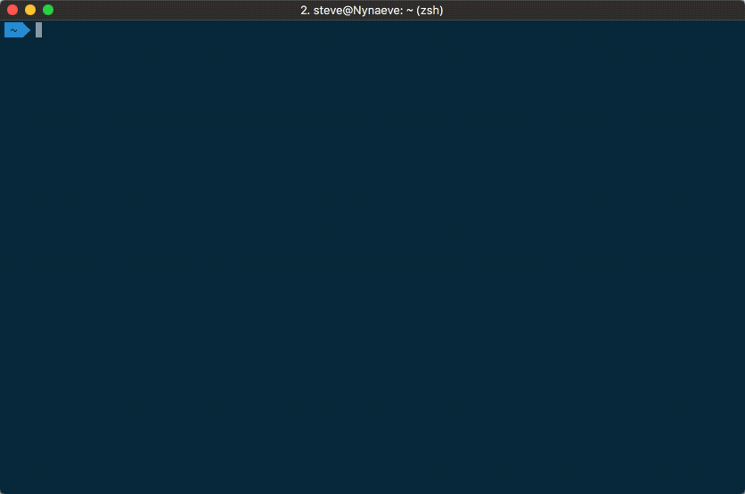
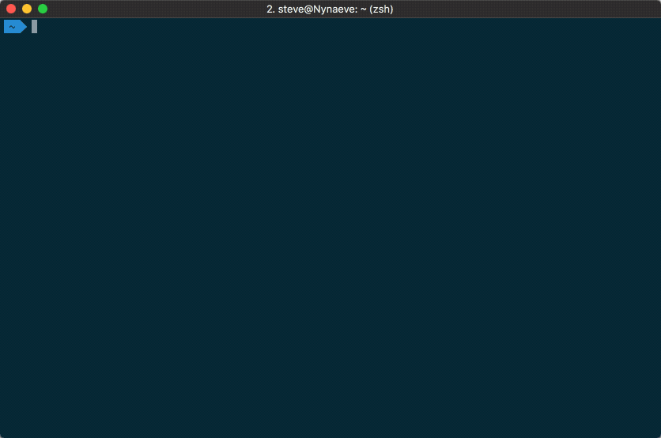

# Container Security UPdate tool

CSUP is a commandline tool designed to interface into Tenable.io's Container Security toolset for the purposes of uploading docker containers, fetching the image reports, and checking the policy compliance and status of the image tests.

```
usage: csup [GLOBAL OPTIONS] {upload,report,policy,status} [ACTION OPTIONS]
```

## Installing

There are a few methods for installing the csup tool.  The first one is to simply download the [packaged binaries](https://github.com/tenable/csup/releases) for both MacOS and Linux.  The second method is to install through pip, and is simply a matter of running `pip install csup`.  You could also manually download and install the package directly using `pip install .` from the resulting folder.

### Requirements

* **python-dateutil** >= 2.6
* **requests** >= 2.18
* **docker** >= 2.6

## Usage

CSUP is designed to be either run as a standalone tool, or to be embedded as part of the build pipeline.  


### Available environment variables

* **TIO_ACCESS_KEY** Tenable.io API Access Key
* **TIO_SECRET_KEY** Tenable.io API Secret Key
* **TIO_CS_ADDRESS** Tenable.io Container Security Address (_default is registry.cloud.tenable.com_)
* **CS_API** Tenable.io Container Security API Path (_default is https://cloud.tenable.com/container-security/api/v1 _)

### Status return code

While this is likely more complex than necessary, if someone wanted to be shwifty they could determine what classes of things caused the failure:

- Policy Violation = 1
- CVSS Threshold Violation = 2
- Discovered Malware = 4
- Potentially Unwanted Programs = 8

Also as the value of no 2 should collide, you could actually determine any combination of things that have failed.  For example 5 would equal malware and a policy violation. 6 would equal CVSS scores and Malware.

### Global Arguments

```
usage: csup [-h] [--access-key ACCESS] [--secret-key SECRET]
            [--consec-path REGISTRY] [--tio-path API]
            {upload,report,policy,status} ...

Container Security UPloading and reporting tool (CSUP) is a commandline tool
designed to interface into Tenable.io's Container Security toolset for the
purposes of uploading docker containers, fetching the image reports, and
checking the policy compliance and status of the image tests. The global
arguments must come before the action and inform csup how to communicate to
Container Security.

optional arguments:
  -h, --help            show this help message and exit
  --access-key ACCESS   Tenable.io API access key
  --secret-key SECRET   Tenable.io API secret sey
  --consec-path REGISTRY
                        alternative Tenable.io registry address
  --tio-path API        alternative Tenable.io URI

valid actions:
  {upload,report,policy,status}
                        additional help available
```

### Upload Action Arguments



```
usage: csup upload [-h] [-t TAG] [-N CONSEC_NAME] [-T CONSEC_TAG] [-r] [-p]
                   [-c CVSS] [-m] [-P] [--json]
                   id

The upload action will upload a docker image to Tenable.io Container Security
and then if specified, will wait for the policy status and/or report to
return. If either the policy returns a non-passing status or if any of the
report thresholds have been tripped, csup will return a non-zero status code.

positional arguments:
  id                    container image name or id

optional arguments:
  -h, --help            show this help message and exit
  -t TAG, --tag TAG     container image tag
  -N CONSEC_NAME, --consec-name CONSEC_NAME
                        ContainerSecurity repository & image path
  -T CONSEC_TAG, --consec-tag CONSEC_TAG
                        ContainerSecurity image tag
  -r, --report          output the test results when tests have completed
  -p, --policy          output the compliance status when tests have completed
  -c CVSS, --cvss CVSS  CVSS Score greater than or equal to this value will
                        return a non-zero exit
  -m, --malware         if malware is discovered and this flag is set, a non-
                        zero exit will occur
  -P, --pups            if Potentially Unwanted Software is discovered and
                        this flag is set, a non-zero exit will occur
  --json                returns the data as a JSON object instead of formatted
                        text
```


### Report Action Arguments



```
usage: csup report [-h] [-w] [-c CVSS] [-m] [-P] [--json] id

Retrieve a report for the image ID specified. If any of the thresholds are set
(and then met), then return a non-zero return status code.

positional arguments:
  id                    container image id

optional arguments:
  -h, --help            show this help message and exit
  -w, --wait            wait for testing of the image to complete
  -c CVSS, --cvss CVSS  CVSS Score greater than or equal to this value will
                        return a non-zero exit
  -m, --malware         if malware is discovered and this flag is set, a non-
                        zero exit will occur
  -P, --pups            if Potentially Unwanted Software is discovered and
                        this flag is set, a non-zero exit will occur
  --json                returns the data as a JSON object instead of formatted
                        text
```

### Policy Action Arguments



```
usage: csup policy [-h] [-w] [--json] id

Retrieve the policy status for the image ID specified. If the policy compliance
status is a failure, then return a non-zero status code.

positional arguments:
  id          container image id

optional arguments:
  -h, --help  show this help message and exit
  -w, --wait  wait for testing of the image to complete
  --json      returns the data as a JSON object instead of formatted text
```

### Status Action Arguments



```
usage: csup status [-h] [--json] id

Get the current job status of the image ID specified.

positional arguments:
  id          image id

optional arguments:
  -h, --help  show this help message and exit
  --json      returns the data as a JSON object instead of formatted text
```

